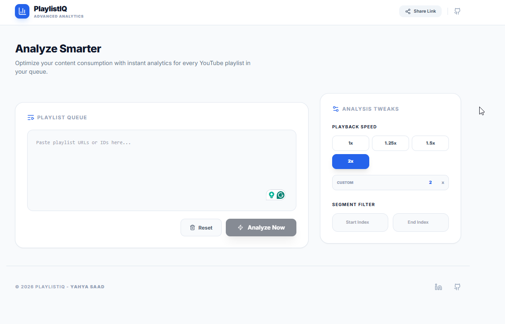

# PlaylistIQ - YouTube Playlist Analysis

Simple tool to calculate how long a YouTube playlist will take.

Live: https://playlistiq.yahya-saad.dev

---

## Preview



---

## Features

- Multiple playlists at once
- Custom speed (1x → any value)
- Select part of a playlist (start / end)
- Share results via URL
- Saves last session locally

---

## Tech

- Node.js + Express
- Alpine.js
- Tailwind CSS
- YouTube Data API v3

---

## Setup

### Requirements
- Node.js 20+
- YouTube API key

### Install

```bash
git clone https://github.com/yahya-saad/playlistiq.git
cd playlistiq
cp .env.example .env
```

Add your key:

```env
YOUTUBE_API_KEY=your_key
```

### Run

```bash
npm install
npm run build:css
npm start
```

---

## Docker

```bash
docker build -t playlistiq .
docker run -p 3000:3000 --env-file .env playlistiq
```

---

## Why

Built to quickly estimate time for long playlists (courses, tutorials, etc).

---

## License

MIT
